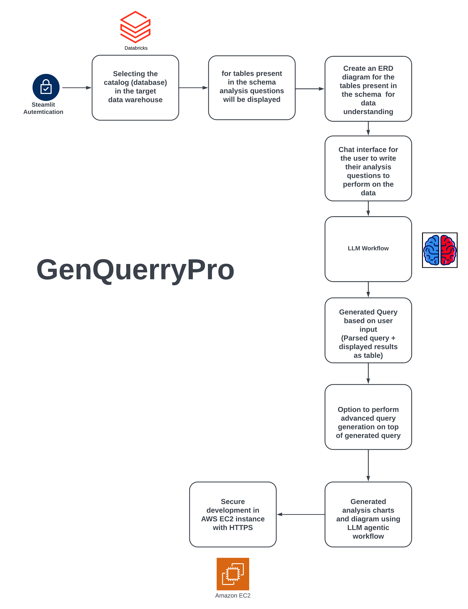

# GenQueryPro

Productivity Improvement tool for Product Managers, Business stakeholders and even intermediate-coders when it comes to working with data stored in a traditional SQL database.

## Architectural Diagram



## Approach

1. Virtual Environment and Dependencies:

Create a Python virtual environment and install necessary libraries (Streamlit, OpenAI, LangChain, database connectors).

Configure access to Databricks and Snowflake, including connection setup and testing.

Set up the development environment in VS Code.

2. LLM Integration and Database Interaction:

Integrate the LLM via API to convert natural language queries into SQL.

Develop backend modules to execute SQL queries on Databricks/Snowflake and retrieve results.

Implement error handling to manage SQL generation and execution issues.

3. Prompt Engineering and SQL Optimization:

Create and refine prompt templates to accurately generate SQL, including complex queries (CTEs, joins).

Implement SQL validation and optimization to ensure generated queries are efficient and correct.

4. User Interface and Authentication:

Build an intuitive Streamlit interface for inputting queries, displaying SQL results, and managing query history/favorites.

Implement user authentication with secure session management and personalized experiences.

5. Advanced Query Handling and Feature Integration:

Develop "Quick Analysis," "Deep Dive Analysis," and "Favorites" sections for enhanced user interaction.

Test the application with complex SQL queries to ensure robustness.

6. Deployment:

Configure and deploy the application on AWS EC2 with HTTPS for secure access and scalable performance.


## Prerequisites
Python 3.10 must be installed.
Ensure you have access to the required datasets and connection strings for databases.

### Virtual Environment Setup Instructions

#### For Mac and Linux:
Open a terminal and navigate to the project directory:

`cd /path/to/GenQuer`

Create a virtual environment using venv:


`python3 -m venv venv`


Activate the virtual environment:


`source venv/bin/activate`

Install the required dependencies from the requirements.txt file:


`pip install -r requirements.txt`

#### For Windows:
Open a command prompt and navigate to the project directory:

`cd \path\to\GenQueryPro`

Create a virtual environment using venv:

`python -m venv venv`


Activate the virtual environment:

`.\venv\Scripts\activate`

Install the required dependencies from the requirements.txt file:


`pip install -r requirements.txt`

#### Project Execution
Run the GenQueryPro application using Streamlit:


`streamlit run GenQueryPro.py`

Access the application:

After running the command, the app will open automatically in your default browser.
If not, navigate to the provided local URL (usually http://localhost:8501/) to access the GenQueryPro interface.


```
GenQueryPro

├─ .streamlit
│  └─ config.toml
├─ Langchain_Intro.ipynb
├─ README.md
├─ GenQueryPro.png
├─ GenQueryPro.py
├─ GenQueryPro_Live.py
├─ artifacts/
├─ authenticator.yml
├─ data/
├─ helper.ipynb
├─ requirements.txt
├─ src
│  ├─ add_logo.py
│  └─ utils.py
├─ test.sql
└─ utils.ipynb

```